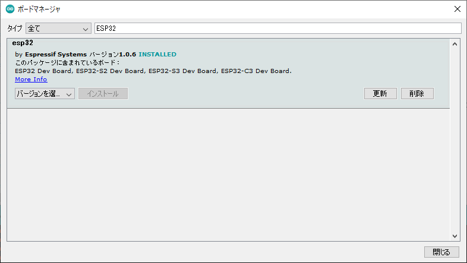
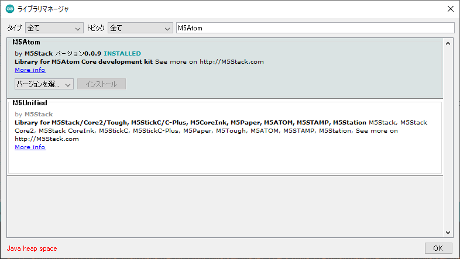
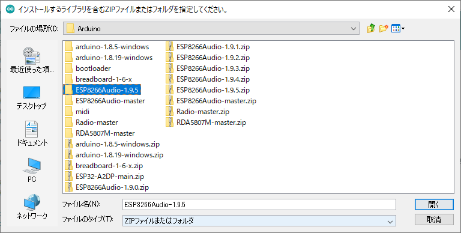
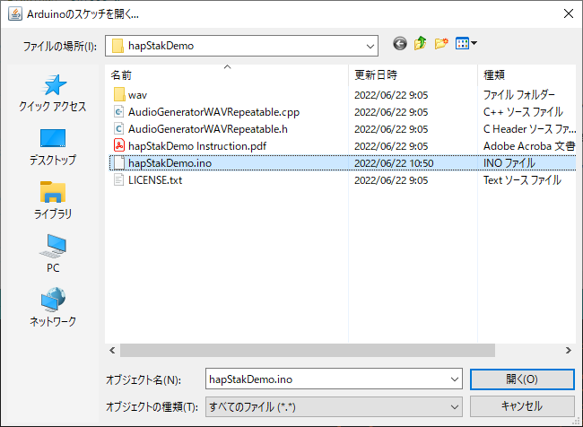
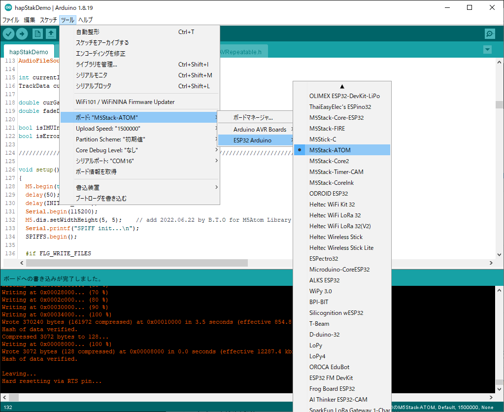

# ADCHACY - hapStakDemo インストール方法

## はじめに
本作例では、触感デバイス開発モジュールとM5Atom Matrixの構成で、14種のSignal Patternsを試すことができます。

## ファイルリスト
- README.md [本ドキュメント]
- LICENSE.txt[ライセンス条項]
- hapStakDemo Instruction.pdf［使用方法］
- hapStakDemo.ino[サンプルプログラム]
- AudioGeneratorWAVRepeatable.cpp[サンプルプログラム]
- AudioGeneratorWAVRepeatable.h[サンプルプログラム]
- wav/*.h[サンプル音源]

## 前提条件
本作例の動作を確認済みの環境は以下になります。
- Arduino IDE 1.8.19（Windows版）
- ESP32ボードライブラリ 1.0.6
- M5Atomライブラリ 0.0.9
- [ESP8266Audio 1.9.5](https://github.com/earlephilhower/ESP8266Audio/tree/1.9.5) [@earlephilhower氏の
ESP8266Audioライブラリを使用させていただきました。] 
Thanks to  @earlephilhower, author of the ESP8266Audio library.

## 注意事項
　2022年6月現在、最新のArduinoのライブラリでは本サンプルソフトの正常なビルドおよび動作が確認できておりません。指定のバージョンのライブラリをインストールした環境を推奨します。

## インストール方法　
- ボードマネージャのインストール 
「ESP32 by Espressif Systems バージョン1.0.6」をインストールします。
  

- M5Atomライブラリのインストール 
「ツール」「ライブラリを管理」からライブラリマネージャを開き、「M5Atom by M5Stack バージョン0.0.9」をインストールします。
  

- ESP8266Audioライブラリ 
GitHubからzip形式でダウンロード後、Arduino IDEの「スケッチ」「ライブラリをインクルード」「.ZIP形式のライブラリをインストール」を選択し、ダウンロードしたzipファイルを指定します。
  

- hapStakDemo 
Arduino IDEの「ファイル」「開く」から予めダウンロード済みの「hapStakDemo.ino」を指定します。
  

- Arduino IDEの設定 
「ツール」メニューから「ボード」は「M5Stack-ATOM」、「シリアルポート」は接続したCOM番号を指定します。
  

- ビルドとインストール 
「スケッチ」「マイコンボードに書き込む」からビルドとインストールを実施します。以降は、[HapStackDemo Instruction](https://github.com/bit-trade-one/ADACHACY-hapStak/tree/master/hapStakDemo/hapStakDemo_Instruction.pdf)に従ってください。